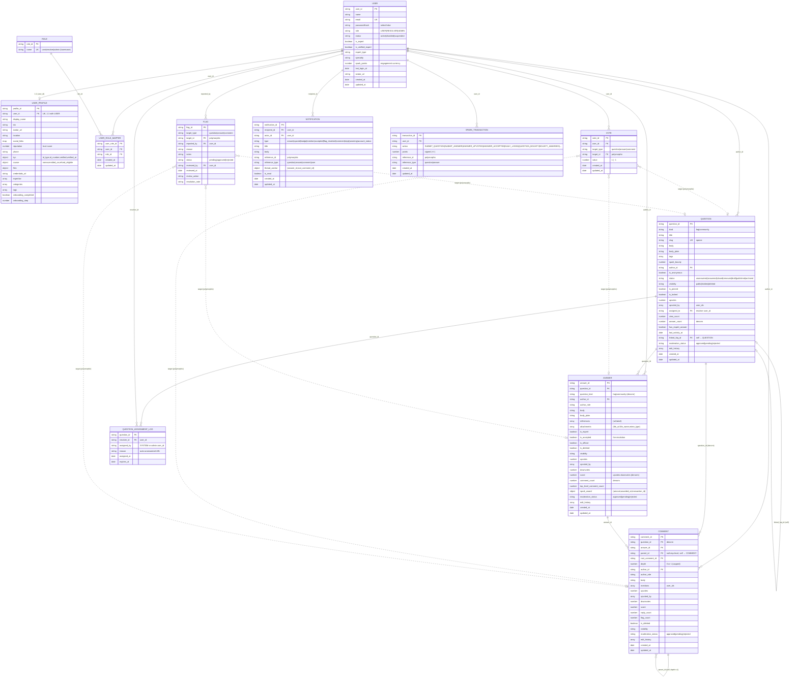

# Rogāre — Entity Relationship Diagram

Current MongoDB Atlas cluster design. This is the **source-of-truth** ERD (the
`er_diagram.png` is a static render and may lag behind this file).

**Conventions**

- It's a document store: every collection has a UUID **string** primary key (`*_id`,
  `default: randomUUID`). There are **no enforced foreign keys** — relationships are
  *logical*, via UUID string fields, resolved in application code.
- `votes` and `flags` are **polymorphic**: `target_type` + `target_id` point at a
  question, answer, or comment (dashed lines below).
- Several counters are **denormalized** (e.g. `questions.answer_count`,
  `answers.comment_count`) and maintained by controllers.

## Notes on relationships

| Relationship | Mechanism |
|---|---|
| User ↔ UserProfile | 1:1 via `user_profiles.user_id` (unique) |
| User ↔ Role | many-to-many through `user_role_mappers` (`user.role` is a denormalized *primary* role cache) |
| Question → Answer → Comment | one-to-many chains; `comments.question_id` is denormalized for single-query moderation |
| Comment self-reference | `parent_id` → parent comment, depth capped at 1 (one level of replies) |
| Question self-reference | `linked_faq_id` → an FAQ a community question was promoted to / duplicates |
| Vote / Flag | polymorphic (`target_type` + `target_id`) → question \| answer \| comment |
| Assignment log | resolver auto-assignment audit trail (cron-driven for unanswered questions) |

## Scoring fields (see `LEADERBOARD.md`)

- `users.spark_points` — engagement currency (login, ask, answer, upvote, accept, bounty).
- `user_profiles.reputation` — trust signal (answer upvotes, accepted answers, expert verification).
- `spark_transactions` — append-only ledger of every spark change.
